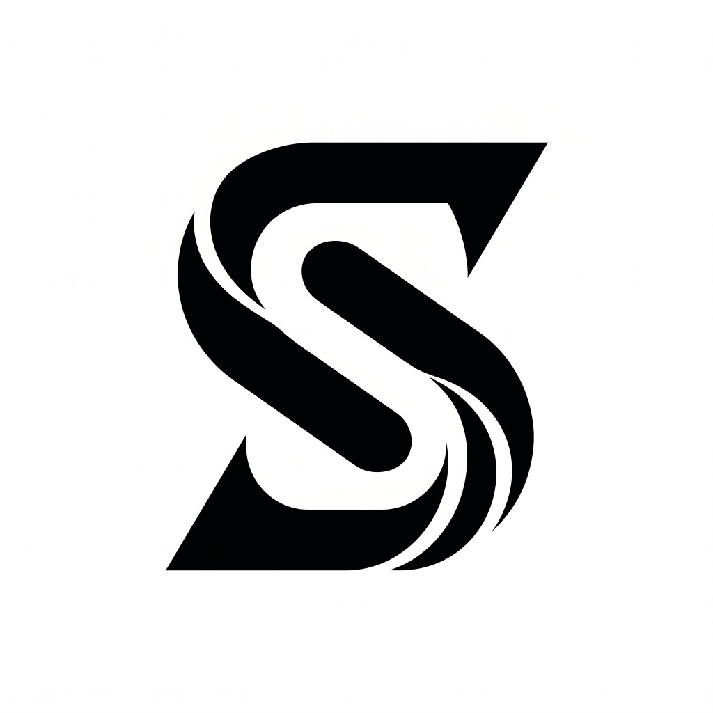

# 🌸 Shahid Portfolio

A premium, highly interactive personal portfolio website inspired by the design quality of Awwwards, customized for **Mohammad Shahid Sajjad Pinjari**. It features a modern pink & black aesthetic, smooth inertia scrolling, physics-based micro-interactions, and custom visual animations.

<div align="center">
  
  <br />
  <br />

  <p>
     A sleek, high-end creative portfolio showcase.
  </p>


  <p>
    <a href="#about">About</a> •
    <a href="#features">Features</a> •
    <a href="#tech">Technologies</a> •
    <a href="#installation">Installation</a>
  </p>

  <br />
</div>

---

## 📋 About <a id="about"></a>

This is the personal portfolio of **Mohammad Shahid Sajjad Pinjari**, a **BCA Student at GH Raisoni College**, Full Stack Developer, and Python Developer. Designed with user experience in mind, this project represents a blend of advanced frontend physics, clean layout styling, and optimized web performance.

---

## ✨ Features <a id="features"></a>

- **Awwwards-Inspired Design:** An interactive pink & black UI built using curated colors, harmonized HSL variables, and smooth animations.
- **Physics-Based Canvas:** A custom floating "Hanging Profile" widget that reacts to mouse drags, gravity, and rope-dampening calculations using vector physics.
- **Sliding Image Galleries:** Synchronized vertical parallax photo tracks that scroll in opposite directions, showcasing custom visual artifacts.
- **Responsive Layout:** Tailored design layouts optimized for both mobile and desktop screens to prevent text clipping and maximize touch readability.
- **Form Integration:** Connect button maps directly to custom outreach services via Tally forms.

---

## 🛠️ Tech Stack <a id="tech"></a>

- **Framework:** Next.js (with Turbopack dev compiler)
- **Programming Languages:** TypeScript, JavaScript, Python
- **Styling:** Tailwind CSS (utility variables, custom theme tokens)
- **Animation:** Framer Motion, Lenis Smooth Scroll
- **Icons & UI:** Lucide React, Radix UI primitives
- **Preloader:** Custom CSS circle/stroke keyframe loader

---

## 🚀 Installation & Local Development <a id="installation"></a>

To run the project in your local development environment:

1. **Clone the repository:**
   ```bash
   git clone https://github.com/sha4real34/kintarowwwards.git
   cd kintarowwwards
   ```

2. **Install dependencies:**
   ```bash
   npm install
   ```

3. **Start the development server:**
   ```bash
   npm run dev
   ```

Open [http://localhost:3000](http://localhost:3000) in your browser to view the live site.

---

<p align="center">
  <sub>Developed with ❤️ by Mohammad Shahid Sajjad Pinjari</sub>
</p>
